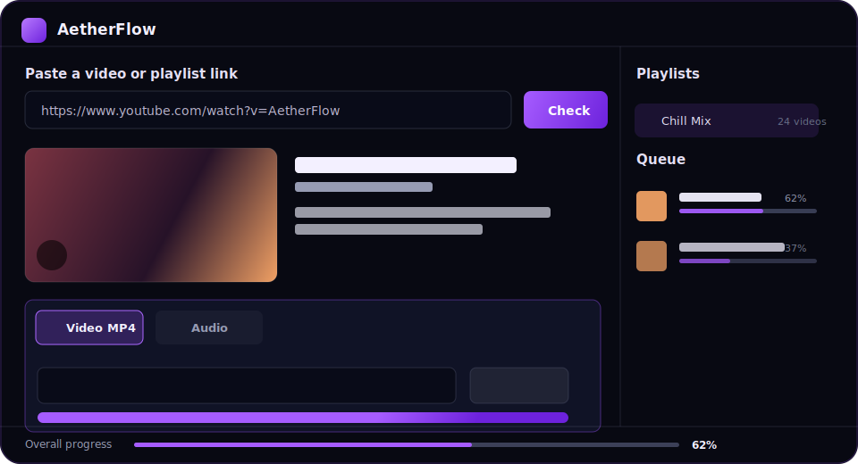

# AetherFlow

Desktop YouTube downloader for Windows with a polished Electron + React interface, playlist support, quality selection, live queue progress, and built-in download tooling.



## Highlights

- Download YouTube videos by URL.
- Download full playlists into a dedicated folder.
- Choose video quality before downloading.
- Save as MP4 video or MP3/M4A audio.
- Track download progress, speed, file size, ETA, and queue state.
- Preview title, channel, thumbnail, duration, and playlist size before downloading.
- Switch the interface language between Russian and English.
- Works as a Windows desktop installer built with Electron Builder.
- Bundles `yt-dlp`, `ffmpeg`, and required Visual C++ runtime DLLs in `resources/bin`.

## Tech Stack

- **Desktop shell:** Electron 33
- **UI:** React 18, Vite, Lucide React, CSS
- **Download engine:** yt-dlp
- **Media processing:** FFmpeg
- **Tests:** Node.js built-in test runner
- **Packaging:** electron-builder, NSIS installer

## Quick Start

```bash
npm install
npm test
npm run build
npm run dist
```

The Windows installer is generated in `release/`.

To prepare files for a landing page download link:

```bash
npm run landing:copy
```

This copies the latest installer into `landing-builds/` with a stable filename: `AetherFlow-Setup-latest.exe`.

## Development

Start the renderer dev server:

```bash
npm run dev
```

Start Electron in another terminal:

```bash
npm run start
```

Run unit tests:

```bash
npm test
```

Build the production renderer:

```bash
npm run build
```

Package the Windows installer:

```bash
npm run dist
```

## Project Structure

```text
resources/bin/           Bundled yt-dlp, ffmpeg, and runtime DLLs
src/main/                Electron main process and IPC handlers
src/main/services/       URL inspection, queue, progress, tools, formats
src/main/preload.cjs     Secure Electron preload bridge
src/renderer/            React application
src/renderer/components/ UI components
tests/                   Unit tests
docs/                    User and developer documentation
```

## Documentation

- [User Guide](docs/USER_GUIDE.md)
- [Developer Guide](docs/DEVELOPER_GUIDE.md)
- [Troubleshooting](docs/TROUBLESHOOTING.md)
- [Landing Build Export](landing-builds/README.md)
- [Changelog](CHANGELOG.md)
- [Contributing](CONTRIBUTING.md)

## Important Notes

`release/`, `dist/`, and `node_modules/` are generated locally and intentionally ignored by Git.

The repository includes `resources/bin` because the packaged application expects bundled download tools. If you replace these binaries, verify:

```bash
resources/bin/yt-dlp.exe --version
resources/bin/ffmpeg.exe -version
```

## License

MIT. See [LICENSE](LICENSE).
